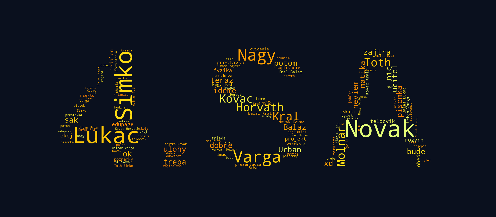
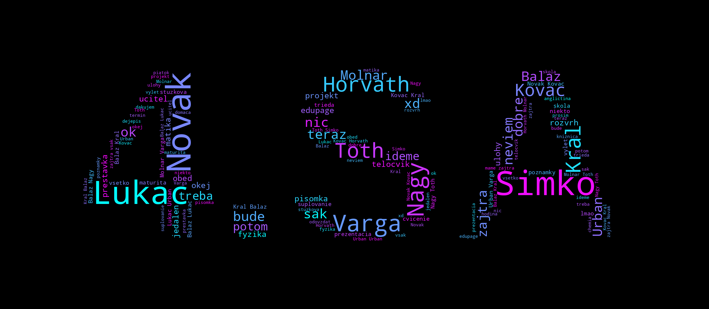
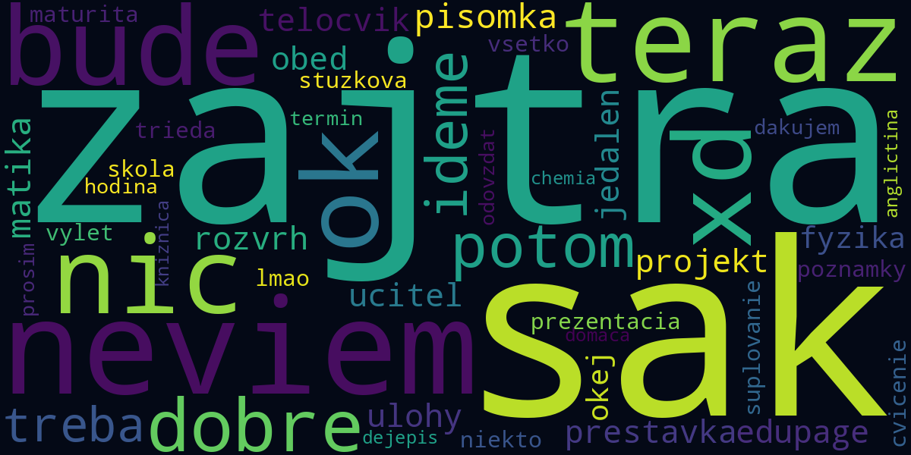
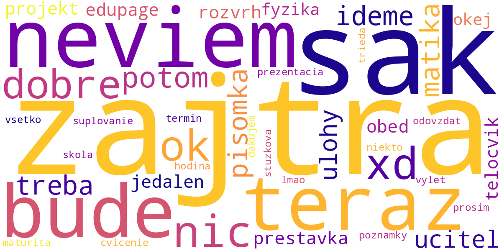

# word-clouds

Word clouds made from Facebook Messenger chats. Originally built to make the
word cloud for our class **oznamka** (graduation announcement): the whole class
group chat, with every classmate's name boosted and fitted into the shape of
the class name.



> All images in this README are generated from made-up data by
> [`examples/make_examples.py`](examples/make_examples.py), no real chats are in this repo.

## Setup

```bash
python -m venv venv
source venv/bin/activate        # windows: venv\Scripts\activate
pip install -r requirements.txt
```

Download your data from Facebook (*Settings → Your information → Download your
information*), pick **JSON** format and at least **Messages**. Unzip it
somewhere outside this repo or into `data/` (gitignored).

## Oznamka word cloud

`oznamka_wordcloud.py` takes a group chat, removes filler words and profanity,
adds every name from `names.txt` a few hundred times so the names come out big
and draws it all inside a mask image.

```bash
cp names.example.txt names.txt   # then put your class in it, one name per line

python oznamka_wordcloud.py \
    --messages data/facebook/messages/inbox/trieda_4sa \
    --mask masks/4sa.png \
    --out wordclouds/oznamka.png
```

The mask is any black-on-white image, words are drawn only into the dark part.
Text in a big bold font (like `4.SA`) or the school logo work well.

| `--colormap Wistia` (default) | `--colormap cool --background black` |
|---|---|
|  |  |

Useful options:

| option | what it does |
|---|---|
| `--text data/database.txt` | use a plain text file instead of the facebook export |
| `--names FILE` | names to boost (default `names.txt`) |
| `--colormap NAME` | any [matplotlib colormap](https://matplotlib.org/stable/gallery/color/colormap_reference.html), e.g. `Wistia`, `cool`, `Blues`, `plasma` |
| `--background COLOR` | `black`, `white` or hex like `#0a101e` |
| `--max-words N` | how many words to draw (default 4500) |
| `--scale N` | resolution multiplier, 5 is enough for printing (default 5) |
| `--repeat` | repeat words until the mask is full, helps with small chats |
| `--save-text FILE` | also save the cleaned chat text, so next time you can use `--text` |

`NAME_BOOST` at the top of the script controls how big the names get.

## Messenger word cloud

`messenger_wordcloud.py` goes through every conversation in the export and
draws the words you (and your friends) use the most.

```bash
python messenger_wordcloud.py data/facebook
python messenger_wordcloud.py data/facebook --background white --colormap plasma
```

| default | `--background white --colormap plasma` |
|---|---|
|  |  |

It takes the export root, the `messages/inbox` folder or a single
`message_1.json`. Size is set with `--width`, `--height` and `--scale`.

## Stop words

`stopwords_sk.txt` is the list of words that are left out: common Slovak filler
words (`a`, `je`, `sa`, `ako`, ...) and profanity so the result can be printed.
Add a word per line to hide it.

## Project structure

```
common.py              loading facebook exports, encoding fix, stop words
oznamka_wordcloud.py   class word cloud with names and a mask
messenger_wordcloud.py word cloud from the whole export
stopwords_sk.txt       words left out of the clouds
names.example.txt      template for names.txt
examples/              demo images + the script that makes them
data/                  your facebook export (gitignored)
wordclouds/            output (gitignored)
```

Facebook saves the text as UTF-8 read as Latin-1 (`Ä` instead of `č`),
`common.fix_encoding` repairs that and strips the accents so `však` and `vsak`
count as one word.
